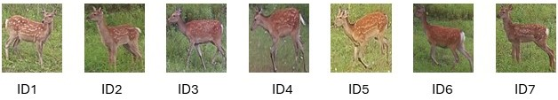

__Muroran IT: "Enhancing Sika Deer Identification: Integrating CNN-Based Siamese Networks with SVM Classification"__

**Siamese Reidentification**
We utilized siamese reidentification for seven individual Sika deer captured by our three camera traps deployed at the periphery of Muroran Institute of Technology, Hokkaido, Japan. In this research, we utilized triplet loss function for the reidentification of Sika deer. We used four different backbone of the basemodels (EfficientNetB7, VGG19, ResNet152, Inception\_v3). We choose the best model among the four backbone of basemodel for embeddings extraction.  We extract the embeddings from the last fully connected layer from the best model; in our study ResNet152 outperformed than other basemodels, hence we extract the embeddings from this basemodel. The extracted embeddings is 128 dimensional vector representation.

    

    

We then performed Principal Component Analysis of the extracted embeddings and used that PCA components for classification task. In our research we used Support Vector Machine (SVM) for the classification of seven individual Sika deer.

**Support Vector Machine**
We used Radial Basis Function kernel, which showed 0.96 cross-validation sores, found to be most suitable for our research. Similarly, we optimized hyperparameters using GridSearchCV library which showed gamma value of 10 and C value of 0.001 was suitable for our work. 

**Implementation**
This research can be supported by Python version above 3.7.13. Install all the required dependencies from requirement.txt and all the captured images should be kept in "dataset" which comprised seven sub-folders each folder for each seven individual Sika deer. As Sika deer live in herds so cropped the individual Sika deer and put the respective image of Sika deer into respective subfolder. 
First, use siamese.ipynb for the siamese reidentification and extract the embeddings and then use that embeddings after Principal Component Analsysis into visualization_svm.ipynb. 
